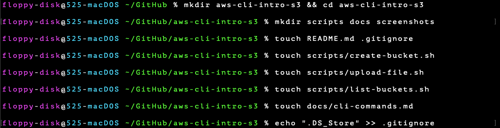
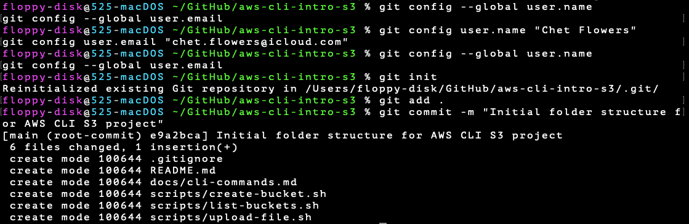
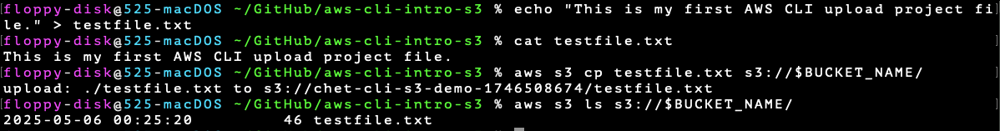
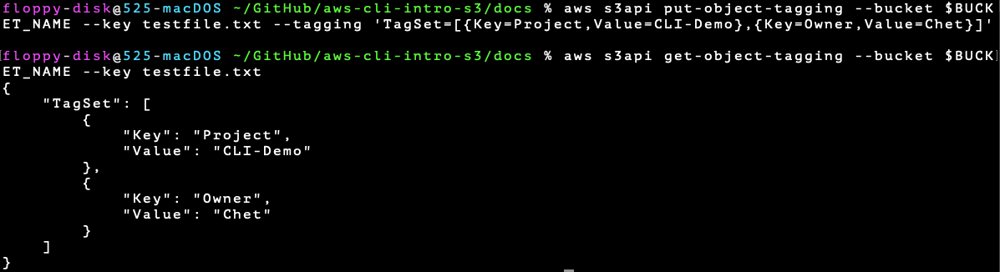
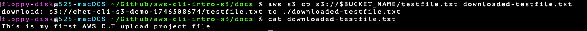
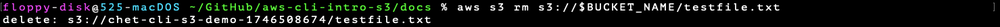

# 🧰 AWS CLI Intro Project – S3 Bucket Management

This project demonstrates beginner-friendly AWS CLI usage by managing an S3 bucket and file lifecycle entirely from the terminal. It includes version-controlled documentation, CLI output screenshots, and bash command breakdowns.

---

## 📦 What You'll Learn

- How to set up and verify AWS CLI access with an IAM user
- How to create an S3 bucket with a dynamic name
- How to upload, tag, download, and delete objects
- How to clean up AWS resources from the command line
- How to organize and document a cloud project using GitHub

---

## 🖼️ Screenshot Highlights

### 📁 Folder Structure Created

📸 `screenshots/folder-structure-created.png`  
Shows the creation of `scripts/`, `docs/`, and `screenshots/` folders for a clean repo layout.



---

### 🔧 Git Initialized

📸 `screenshots/git-init-repo.png`  
Displays `git init` and initial setup for version control.



---

### 🪄 Bucket Name Generated Dynamically

📸 `screenshots/bucket-name-generated.png`  
A unique bucket name is created using the Unix timestamp and an environment variable.


---

### 📤 File Created, Uploaded, and Verified in S3

📸 `screenshots/file-upload-and-verify.png`  
Shows `echo` used to create a file, `cat` to verify content, `aws s3 cp` to upload, and `aws s3 ls` to confirm upload.



---

### 🏷️ Tags Added to S3 Object

📸 `screenshots/file-object-tagging.png`  
Demonstrates using `aws s3api put-object-tagging` and `get-object-tagging` to add metadata to the object.



---

### 💾 File Downloaded and Verified

📸 `screenshots/file-download-and-verify.png`  
Shows the object being downloaded from S3, content verified with `cat`.



---

### 🗑️ File Deleted and Bucket Cleaned Up

📸 `screenshots/file-deletion.pmg.png`  
Shows deletion of the object using `aws s3 rm` and bucket cleanup with `aws s3 rb`.



---

## 🗂️ Folder Structure

```
aws-cli-intro-s3/
├── scripts/                # Optional CLI automation scripts
├── docs/                   # Step-by-step CLI documentation
├── screenshots/            # Project screenshots
├── README.md               # This file
├── testfile.txt            # Original uploaded file
├── downloaded-testfile.txt # Downloaded copy for validation
```

---

## 📘 Documentation

See `docs/cli-commands.md` for a full breakdown of every command used and what it does.

---

## 🧰 Scripts

| Script | Description |
|--------|-------------|
| `scripts/create-bucket.sh` | Creates a uniquely named S3 bucket using timestamp |
| `scripts/upload-file.sh <bucket-name>` | Uploads `testfile.txt` to specified S3 bucket |
| `scripts/list-buckets.sh` | Lists all accessible S3 buckets |

---

## 🔐 IAM & Security Notes

- CLI access was done using a dedicated IAM user
- No root access or long-term access keys used
- Bucket names and object tags are dynamically generated for safety and uniqueness

---

## 👨‍💻 Author

**Chet Flowers**  
[GitHub: chetflowers](https://github.com/chetflowers)
